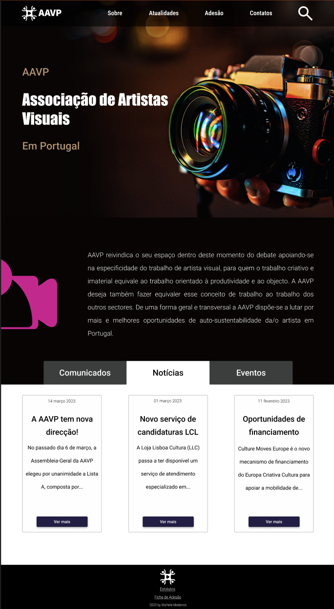

# Proposta

## Produção de uma single page application

### Michele França de Medeiros - al80305

O código foi desenvolvido a partir do redesign do site da AAVP realizado na disciplina de web-design, segue abaixo um print do wireframe de alta fidelidade da home.

Vale salientar que algumas modificações foram feitas a fim de atender os requisitos estabelecidos para este trabalho.

### Alterações nos Requisitos

- Gostaria de destacar que, apesar de não evidente, por fins estéticos, **o header possui uma animação da logomarca** como exigido. Para visualizá-la basta **clicar sobre o logo** que a mesma irá girar.

- Ainda sobre requisitos, era solicitado que o body possuísse uma margem entre 10px e 30px e fosse branco. A margem escolhida foi a de 10px, porém, a cor usada foi preto, devido ao fato do layout da aplicação ser em tons escuros, de modo que, quando colocado na cor "branco" o mesmo fica com aparência desconexa do restante do site. Segue print do teste realizado com o body na cor "branco"

